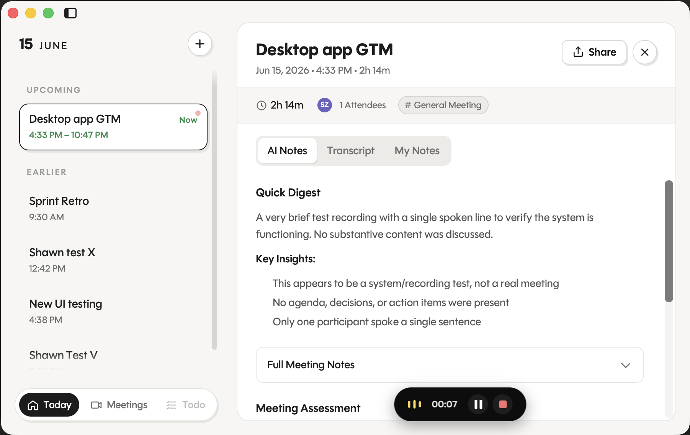
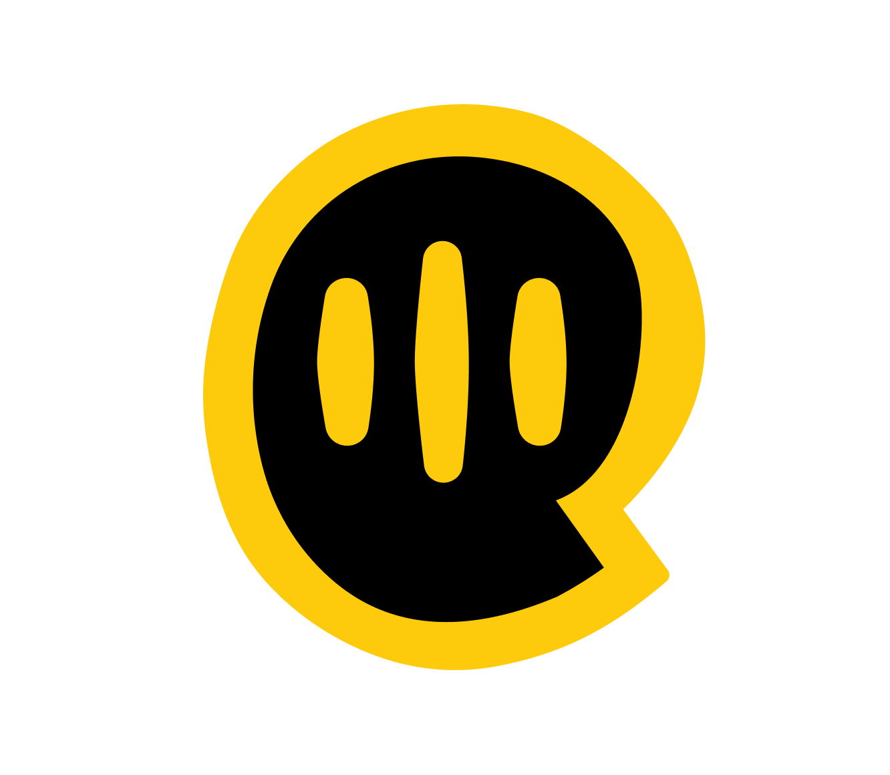

<div align="center">

<picture>
  <source media="(prefers-color-scheme: dark)" srcset="src/assets/oats-dark.svg">
  
</picture>

# oats

**Your meetings, written up for you — on macOS.**

*You talk. It listens. You get notes. Free in the cloud, or 100% offline on your own Mac.*

[](https://github.com/ariso-ai/oats/actions/workflows/desktop.yaml)
[](https://github.com/ariso-ai/oats/actions/workflows/release.yaml)
[](https://pub-dd2807d512d34e55b8a863f675ea8e6e.r2.dev/desktop/oats.dmg)

[](https://github.com/ariso-ai/oats/releases/latest)
[](https://v2.tauri.app/)
[](https://vuejs.org/)
[](https://claude.com/claude-code)
[](LICENSE)
[](CONTRIBUTING.md)


<br>



</div>

---

oats lives in your menu bar and stays out of the way. Hit record, get back to your meeting, forget it's running. When you're done it hands you a clean transcript and a tidy set of notes. No tab to babysit, no bot to invite, no "sorry, can you repeat that?"

You decide where the work happens:

- ☁️ **Free, in the cloud** — sign in and let [Ariso](https://ariso.ai) do the heavy lifting. Real-time transcription, zero setup.
- 🔒 **Private, on your Mac** — flip one switch and recording, transcription, speaker labels, and notes all run **offline**. No login. No upload. Nothing leaves your machine.

## ✨ Features

- 🎙️ **One-click recording** from the menu bar. Pause, resume, stop — without leaving what you're doing.
- ⚡ **Real-time transcription** that streams in as people talk.
- 🗣️ **Speaker labels** — who said what, sorted out for you.
- 📝 **Automatic notes** — a clean Markdown summary for every recording.
- 📚 **Library** — every recording, transcript, and note in one place.
- 🔗 **Share** — native macOS share sheet, or share to the web (Ariso backend).
- 🔄 **Auto-updates** — signed, notarized, and quietly current.

## 📥 Install

> **Requires Apple Silicon (M-series) and macOS 14 or later.**

### 🍺 Homebrew

```bash
# Add the tap (the cask lives in this repo, so point Homebrew at it directly)
brew tap ariso-ai/oats https://github.com/ariso-ai/oats

# Trust the cask, then install
brew trust --cask ariso-ai/oats/oats
brew install --cask oats
```

> Homebrew 6.0 introduced [tap trust](https://docs.brew.sh/Tap-Trust): third-party taps must be explicitly trusted before they install. The `brew trust` step grants that once — without it you'll see `Refusing to load cask … from untrusted tap`.

### 📦 Direct download

1. Download the latest `oats.dmg` from the [**Releases page**](https://github.com/ariso-ai/oats/releases/latest).
2. Open the DMG and drag **oats** into your Applications folder.
3. Launch it from Applications. oats lives in your menu bar — look for the  icon.

The app is **code-signed and notarized by Apple**, and keeps itself up to date as new versions ship.

## 🚀 Getting started

First launch, pick a transcription backend in **Settings → Transcription Backend**:

### ☁️ Ariso — free, in the cloud

The default. Sign in, hit record. Audio streams to the Ariso backend, which transcribes it in real time and keeps your meetings so you can revisit and share them from anywhere. **Free** — pick this if you want zero setup and don't mind your transcripts living in the cloud.

### 🔒 Local — private, 100% offline

Sensitive conversation? Switch the backend to **Local** and oats does *everything* on your Mac:

- **Recording** is captured and saved locally.
- **Transcription** runs on the Apple Neural Engine ([Parakeet](https://github.com/FluidInference/FluidAudio) ASR + speaker diarization).
- **Notes** are written by an on-device language model — no API calls.

No login, no upload — your audio, transcripts, and notes never leave your machine. There's a one-time download for the models: open **Settings → On-device models** and install the **speech voice model** and **language model** (each shows a green tick when ready). After that, oats works completely offline.

Everything is stored locally under `~/.ariso/recordings/`:

| File            | Contents                          |
| --------------- | --------------------------------- |
| `recording.mp3` | The audio of your meeting         |
| `transcript.md` | The full transcript               |
| `note.md`       | The generated meeting summary     |

## 🔐 Privacy at a glance

| | ☁️ Ariso (cloud) | 🔒 Local (on-device) |
| --- | --- | --- |
| **Cost** | Free | Free |
| **Account / login** | Required | None |
| **Audio leaves your Mac** | Yes (to Ariso) | **Never** |
| **Transcription** | Ariso backend | Apple Neural Engine |
| **Summary notes** | Ariso backend | On-device LLM |
| **Works offline** | No | **Yes** |
| **Best for** | Convenience, sharing, any Mac | Confidential meetings, air-gapped use |

## 🤝 Contributing

oats is open source, and we'd love your help — a bug report, a feature idea, or a pull request all count.

👉 **[CONTRIBUTING.md](CONTRIBUTING.md)** walks through setting up a dev environment, building the app and the on-device sidecar, running the tests, and cutting a release.

## 📄 License

oats is open source under the [MIT License](LICENSE).

## 🛠️ Built with

[Tauri v2](https://v2.tauri.app/) · [Vue 3](https://vuejs.org/) · [Vite](https://vite.dev/) · [Rust](https://www.rust-lang.org/) · [FluidAudio](https://github.com/FluidInference/FluidAudio) · [MLX](https://github.com/ml-explore/mlx-swift-lm) · and a lot of [Claude Code](https://claude.com/claude-code).

<div align="center">
<sub>Made with  by <a href="https://ariso.ai">Ariso</a></sub>
</div>
