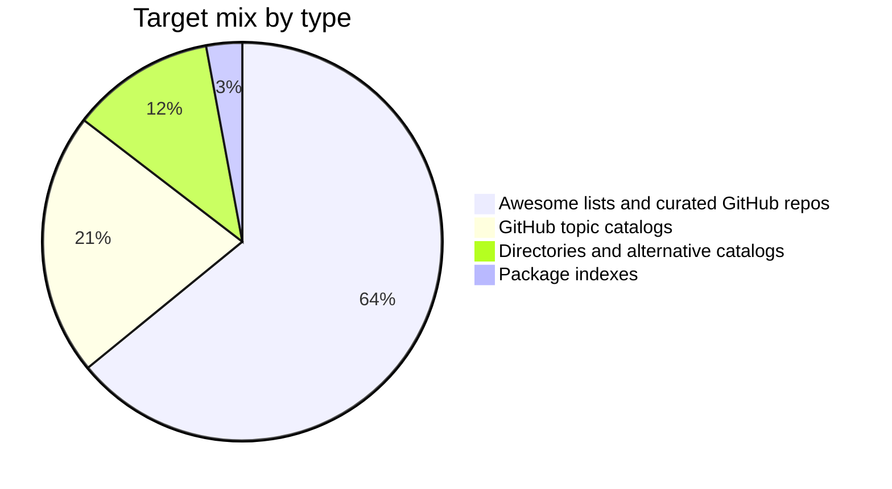
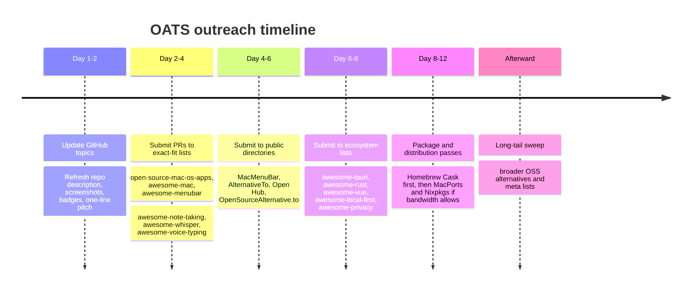

# OATS Listing Target Research Report

## Executive summary

OATS is unusually well positioned for catalog and list inclusion because its public positioning spans several high-demand discovery surfaces at once: it is a free and open-source macOS app for meeting notes, transcription, and AI summaries; it emphasizes privacy and on-device use; and its GitHub metadata already aligns with tags such as `speech-to-text`, `transcription`, `meeting-notes`, `menubar-app`, `local-first`, `apple-silicon`, `tauri`, `rust`, and `vue`. The repository README also states that OATS runs on macOS 14+ and Apple Silicon, can work “free in the cloud” or “100% on-device,” and uses Tauri, Vue, and Rust. That combination makes OATS relevant not just to note-taking and productivity lists, but also to privacy, local AI, Whisper/ASR, menubar-app, Apple Silicon, and Tauri ecosystem catalogs. citeturn1view0turn13search1turn35search0turn36search2

The highest-confidence listing surfaces are the ones with explicit self-service or contribution workflows: GitHub Topics pages can be activated directly by managing repo topics; GitHub awesome lists typically accept pull requests; AlternativeTo documents how to suggest a new app; SaaSHub has a dedicated submit flow; MacMenuBar has a dedicated “Submit Menu Bar App” page; Open Hub says it is community-driven and supports “Add New Project”; the Free Software Directory documents a “Submit a new entry” workflow; and Homebrew Cask explicitly says new casks should be submitted by pull request rather than issue. citeturn13search18turn5search0turn16search2turn11search0turn10view1turn18search0turn18search14turn18search2turn19search1turn27search0

The fastest path is not a directory at all, but GitHub metadata hygiene: OATS can immediately improve discoverability across multiple GitHub topic catalogs without waiting for moderation, by tightening and expanding its topics around `meeting-notes`, `speech-to-text`, `ai-notes`, `local-first`, `menubar-app`, `tauri`, `privacy`, `macos-application`, and `apple-silicon`. GitHub topic pages themselves say that repositories are associated by managing topics on the repo page. citeturn13search18turn36search2turn35search0turn35search2

For external outreach, the best first curated target is **serhii-londar/open-source-mac-os-apps** because it is explicitly an awesome list of open-source macOS applications and publishes contribution guidance, while OATS is an open-source Mac app with a clear desktop end-user value proposition. Immediately after that, the strongest sequence is: `awesome-tauri`, `awesome-mac`, `awesome-menubar`, `awesome-note-taking`, `awesome-whisper`, `awesome-voice-typing`, `MacMenuBar.com`, `AlternativeTo`, and `Open Hub`. citeturn5search1turn5search0turn17search1turn16search2turn6search0turn6search2turn18search0turn11search0turn18search2

This report compiles **103 deduplicated targets**. The list is intentionally English-first, but it also includes a small number of multilingual or non-English assets where fit is high enough to justify the effort.

## Methodology and OATS fit profile

I used a fit-first discovery method rather than a generic startup-directory sweep. The inclusion criteria were: the target is public; the target has either a documented listing/submission path or an open GitHub repo where additions are plausibly made by pull request; the target is relevant to at least one core OATS facet; and the target is meaningfully discoverable by developers, Mac users, privacy-conscious users, or people actively looking for note-taking / transcription / local-AI tools. The main discovery anchors were OATS’s own README and GitHub topic metadata, then official contribution and submission pages for GitHub lists and public directories. citeturn1view0turn13search1turn5search0turn16search2turn11search0turn18search2turn19search1turn27search0

The most important OATS matching dimensions were these:

| OATS dimension | Why it matters for inclusion |
|---|---|
| macOS app | Opens Mac app directories, Apple Silicon lists, menubar-app lists, macOS awesome lists |
| open source | Qualifies OATS for FOSS lists, open-source alternative directories, Open Hub, Free Software Directory |
| meeting notes | Opens note-taking, productivity, PKM, and meeting-notes topic catalogs |
| speech-to-text / transcription | Opens Whisper, ASR, dictation, diarization, and voice typing lists |
| privacy / on-device | Opens privacy, local-first, offline / on-device AI, and privacy-first software lists |
| Tauri / Rust / Vue | Opens ecosystem lists, package catalogs, and GitHub topic catalogs for the underlying stack |

Those dimensions are directly supported by the repo README and visible topic tags. citeturn1view0turn13search1turn35search0

Acceptance likelihood in the master table is an analyst judgment, not a guarantee. I scored it using four concrete signals: category fit, whether the target explicitly welcomes contributions or submissions, whether the target is broad versus niche, and whether OATS would require extra packaging or curation effort beyond a simple listing. That is why GitHub Topics are mostly “high,” PR-driven awesome lists are usually “high” or “medium,” directories with clear forms are “medium” to “high,” and package indexes are often “medium” or “low” because they require packaging review rather than simple editorial inclusion. citeturn13search18turn16search2turn11search0turn27search0turn27search2

## Categorization and target mix

The most useful schema for outreach is not by site type alone, but by **audience** and **intent**.

| Audience category | Intent category | What OATS is “competing” on | Best target families |
|---|---|---|---|
| Mac power users | End-user discovery | menubar utility, Apple Silicon app, Mac productivity | MacMenuBar, open-source Mac app lists, awesome-mac lists |
| Notes / PKM users | Workflow replacement / augmentation | meeting notes, note capture, markdown export, searchable notes | awesome-note-taking, PKM / KM / Markdown lists, AlternativeTo |
| Privacy-first users | Trust / control | on-device, local-first, no forced cloud | privacy and local-first lists, GitHub topics |
| Developers / OSS users | Open-source discovery | self-hostable-ish local workflow, OSS desktop tooling | Open Hub, Free Software Directory, Awesome Open Source, open-source alternatives lists |
| AI / speech users | Technical discovery | Whisper/ASR, speech-to-text, diarization-adjacent workflows | awesome-whisper, awesome-voice-typing, ASR lists, speech topics |
| Stack-specific builders | Ecosystem discovery | Tauri, Rust, Vue app showcase | awesome-tauri, awesome-rust, awesome-vue, GitHub topics, package indexes |

The practical implication is that the outreach order should follow **precision before breadth**: first the exact-fit categories where OATS is obviously in-scope, then the broader OSS and platform catalogs, then the package indexes and long-tail meta lists.

The highest-value mapping of targets to categories is:

- **Mac end-user discovery**: `open-source-mac-os-apps`, `awesome-mac`, `awesome-macOS`, `awesome-macos`, `awesome-mac-apps`, `awesome-menubar`, `MacMenuBar.com`, `awesome-apple-silicon`.
- **Notes / PKM / productivity**: `awesome-note-taking`, `awesome-pkm`, `awesome-knowledge-management`, `awesome-productivity`, `awesome-markdown`, GitHub topics for `meeting-notes`, `note-taking`, `personal-knowledge-management`, `knowledge-management`.
- **Speech / transcription / local AI**: `awesome-whisper`, `Awesome-Whisper-Apps`, `awesome-voice-typing`, `awesome-speech-recognition-speech-synthesis-papers`, `awesome-diarization`, GitHub topics for `speech-to-text`, `automatic-speech-recognition`, `offline-speech-recognition`, `transcription`.
- **Privacy / local-first**: `awesome-privacy`, `awesome-local-first`, GitHub topics for `privacy`, `local-first`, `local-first-ai`, `ai-notes`.
- **OSS / alternatives / software directories**: `AlternativeTo`, `Open Hub`, `Free Software Directory`, `Awesome Open Source`, `Open Apps`, `OpenAlternative`, `OpenSourceAlternative.to`, `SourceForge Directory`, `LibHunt`, `RunaCapital/awesome-oss-alternatives`, `definitive-opensource`.
- **Stack / ecosystem**: `awesome-tauri`, `awesome-rust`, `awesome-vue`, GitHub topics for `tauri`, `tauri-app`, `rust-lang`, `macos-application`, `menubar-app`. citeturn5search1turn5search0turn17search1turn18search0turn16search2turn33search11turn6search0turn6search2turn29search3turn35search0turn35search4turn36search0turn36search4turn11search0turn18search2turn19search10turn20search1turn22search1turn12search0turn11search11

## Deduplicated master table

The `URL` column below is the primary official source for each target, which also serves as the per-entry source link the request asked for. The list is globally deduplicated across all three table blocks.

**Curated GitHub lists and user-curated repos**

| Name | URL | Type | Primary audience | Intent / use-case | Submission method | Acceptance likelihood with rationale | Tags / keywords matched to OATS | Geographic / language focus |
|---|---|---|---|---|---|---|---|---|
| tauri-apps/awesome-tauri | [GitHub](https://github.com/tauri-apps/awesome-tauri) | awesome list | Tauri builders | ecosystem showcase | PR | High — exact framework fit | tauri, desktop-app, rust, macos | Global / English |
| jaywcjlove/awesome-mac | [GitHub](https://github.com/jaywcjlove/awesome-mac) | awesome list | Mac users | Mac app discovery | PR | High — strong Mac/deskop fit, PRs welcome | macos, productivity, menubar, open-source | Global / English |
| serhii-londar/open-source-mac-os-apps | [GitHub](https://github.com/serhii-londar/open-source-mac-os-apps) | awesome list | Mac OSS users | open-source Mac apps | PR | High — exact scope match | macos, open-source, productivity, notes | Global / English |
| iCHAIT/awesome-macOS | [GitHub](https://github.com/iCHAIT/awesome-macOS) | awesome list | Mac users | Mac software discovery | PR | High — Mac app list with contribution guide | macos, menubar, productivity, notes | Global / English |
| phmullins/awesome-macos | [GitHub](https://github.com/phmullins/awesome-macos) | awesome list | Mac users | categorized Mac apps | PR | High — broad Mac coverage | macos, productivity, communication, docs | Global / English |
| viraat/awesome-mac-apps | [GitHub](https://github.com/viraat/awesome-mac-apps) | awesome list | Mac developers | free/open-source Mac apps | PR / issue | High — open-source Mac apps focus | macos, open-source, productivity | Global / English |
| jordanbaird/awesome-menubar | [GitHub](https://github.com/jordanbaird/awesome-menubar) | awesome list | menubar-app users | menu bar app discovery | PR | High — exact UI pattern fit | menubar-app, macos, productivity | Global / English |
| tborychowski/awesome-mac | [GitHub](https://github.com/tborychowski/awesome-mac) | awesome list | Mac power users | personal Mac app curation | issue / PR | Medium — subjective list, but OATS fits | macos, ai, notes, productivity | Global / English |
| antelle/my-awesome-mac-apps | [GitHub](https://github.com/antelle/my-awesome-mac-apps) | awesome list | Mac power users | curated Mac app picks | PR | Medium — personal list, still accepts contributions | macos, productivity, notes | Global / English |
| feep/awesome-apple-silicon | [GitHub](https://github.com/feep/awesome-apple-silicon) | awesome list | Apple Silicon users | Apple Silicon software resources | PR | High — OATS requires Apple Silicon | apple-silicon, macos, native | Global / English |
| smashism/awesome-macadmin-tools | [GitHub](https://github.com/smashism/awesome-macadmin-tools) | awesome list | Mac admins | Mac tooling discovery | PR | Low — audience is admins, not end users | macos, utility, menubar | Global / English |
| rust-unofficial/awesome-rust | [GitHub](https://github.com/rust-unofficial/awesome-rust) | awesome list | Rust developers | Rust project discovery | PR | Medium — broad, but OATS is a Rust app | rust, desktop-app, productivity | Global / English |
| awesome-rust-com/awesome-rust | [GitHub](https://github.com/awesome-rust-com/awesome-rust) | awesome list | Rust developers | Rust frameworks and software | PR | Medium — broad but apps section exists | rust, application, macos | Global / English |
| vuejs/awesome-vue | [GitHub](https://github.com/vuejs/awesome-vue) | awesome list | Vue developers | Vue ecosystem discovery | PR | Medium — broad framework list | vue, tauri-frontend, desktop-ui | Global / English |
| sonicoder86/awesome-vue-3 | [GitHub](https://github.com/sonicoder86/awesome-vue-3) | awesome list | Vue 3 developers | Vue 3 tooling and examples | PR | Medium — broad, but OATS uses Vue | vue3, desktop-ui, productivity | Global / English |
| sudhakar3697/awesome-electron-alternatives | [GitHub](https://github.com/sudhakar3697/awesome-electron-alternatives) | awesome list | desktop-app builders | Electron alternatives | PR | High — Tauri app is an exact alt-to-Electron ecosystem fit | tauri, desktop-app, rust, performance | Global / English |
| pluja/awesome-privacy | [GitHub](https://github.com/pluja/awesome-privacy) | awesome list | privacy-focused users | privacy-respecting services/tools | PR | High — privacy/on-device positioning aligns closely | privacy, local-first, on-device | Global / English |
| lissy93/awesome-privacy | [GitHub](https://github.com/lissy93/awesome-privacy) | awesome list | privacy-focused users | privacy tools discovery | PR | High — strong privacy-first fit | privacy, macos, notes, local | Global / English |
| iAnonymous3000/awesome-privacy-tools | [GitHub](https://github.com/iAnonymous3000/awesome-privacy-tools) | awesome list | privacy users | privacy tool catalog | PR | High — OATS’s privacy story is central | privacy, note-taking, local-first | Global / English |
| janhq/awesome-local-ai | [GitHub](https://github.com/janhq/awesome-local-ai) | awesome list | local-AI users | run AI locally | PR | High — OATS can run fully on-device | local-ai, on-device, privacy, macos | Global / English |
| msb-msb/awesome-local-ai | [GitHub](https://github.com/msb-msb/awesome-local-ai) | awesome list | local-AI users | consumer local AI resources | PR | High — privacy/local hardware angle matches | local-ai, on-device, apple-silicon | Global / English |
| rafska/awesome-local-llm | [GitHub](https://github.com/rafska/awesome-local-llm) | awesome list | local-LLM users | local model tools/platforms | PR | Medium — OATS is app-layer, not model infra | local-llm, local-ai, on-device | Global / English |
| vince-lam/awesome-local-llms | [GitHub](https://github.com/vince-lam/awesome-local-llms) | awesome list | local-LLM users | compare local-LLM projects | PR | Medium — infra-adjacent but still relevant | local-ai, privacy, on-device | Global / English |
| awesome-selfhosted/awesome-selfhosted | [GitHub](https://github.com/awesome-selfhosted/awesome-selfhosted) | awesome list | self-hosting users | self-hosted software discovery | PR | Low — OATS is desktop-first, not a hosted service | local-first, privacy, self-hosted-ish | Global / English |
| haiiiiiyun/awesome-selfhosted-cn | [GitHub](https://github.com/haiiiiiyun/awesome-selfhosted-cn) | awesome list | Chinese self-hosting users | localized self-hosted catalog | PR | Low — same mismatch as above | privacy, local, notes | China / Chinese |
| alexanderop/awesome-local-first | [GitHub](https://github.com/alexanderop/awesome-local-first) | awesome list | local-first builders/users | local-first software catalog | PR | High — exact architectural fit | local-first, privacy, offline, notes | Global / English |
| schickling/awesome-local-first | [GitHub](https://github.com/schickling/awesome-local-first) | awesome list | local-first builders | local-first projects | PR | High — exact fit | local-first, collaboration, notes | Global / English |
| alantriesagain/awesome-local-first | [GitHub](https://github.com/alantriesagain/awesome-local-first) | awesome list | local-first builders | local-first apps/resources | PR | High — direct fit | local-first, privacy, offline | Global / English |
| zhongkechen/awesome-local-first | [GitHub](https://github.com/zhongkechen/awesome-local-first) | awesome list | local-first builders | local-first software list | PR | High — exact fit | local-first, note-taking, privacy | Global / English |
| sindresorhus/awesome-whisper | [GitHub](https://github.com/sindresorhus/awesome-whisper) | awesome list | Whisper / ASR users | Whisper ecosystem discovery | PR | High — OATS directly uses transcription value prop | whisper, speech-to-text, transcription | Global / English |
| danielrosehill/Awesome-Whisper-Apps | [GitHub](https://github.com/danielrosehill/Awesome-Whisper-Apps) | awesome list | speech-tool users | Whisper-powered app showcase | PR | High — app-layer match is excellent | whisper, transcription, meeting-notes | Global / English |
| ancs21/awesome-openai-whisper | [GitHub](https://github.com/ancs21/awesome-openai-whisper) | awesome list | Whisper users | Whisper resources/apps | PR | High — OATS is in-scope technically | whisper, speech-recognition, stt | Global / English |
| MIBlue119/awesome-whisper-application | [GitHub](https://github.com/MIBlue119/awesome-whisper-application) | awesome list | Whisper hackers | application examples | PR | Medium — smaller list, but direct fit | whisper, asr, meeting notes | Global / English |
| primaprashant/awesome-voice-typing | [GitHub](https://github.com/primaprashant/awesome-voice-typing) | awesome list | dictation users | voice typing and STT tools | PR | High — exact speech-to-text utility fit | voice-typing, speech-to-text, offline | Global / English |
| zzw922cn/awesome-speech-recognition-speech-synthesis-papers | [GitHub](https://github.com/zzw922cn/awesome-speech-recognition-speech-synthesis-papers) | awesome list | speech researchers | ASR/TTS paper roadmap | PR | Low — research list, not product-first | speech-recognition, asr | Global / English |
| goldsmith/awesome-speech-recognition-papers | [GitHub](https://github.com/goldsmith/awesome-speech-recognition-papers) | awesome list | speech researchers | ASR roadmap | PR | Low — paper list, low user acquisition value | asr, speech-recognition | Global / English |
| wq2012/awesome-diarization | [GitHub](https://github.com/wq2012/awesome-diarization) | awesome list | diarization researchers | speaker diarization resources | PR | Medium — speaker separation is adjacent to meeting notes | speaker-diarization, transcription | Global / English |
| steven2358/awesome-generative-ai | [GitHub](https://github.com/steven2358/awesome-generative-ai) | awesome list | AI builders | GenAI applications landscape | PR | Medium — broad AI list, but OATS is AI app | generative-ai, ai-notes | Global / English |
| alvinreal/awesome-opensource-ai | [GitHub](https://github.com/alvinreal/awesome-opensource-ai) | awesome list | open-source AI users | open-source AI projects | PR | Medium — OATS is an AI-enabled app | open-source-ai, local-ai, privacy | Global / English |
| suncloudsmoon/awesome-open-source-ai | [GitHub](https://github.com/suncloudsmoon/awesome-open-source-ai) | awesome list | open-source AI users | useful AI tools and models | PR | Medium — broad but relevant | open-source-ai, stt, tools | Global / English |
| swiftsimplify/awesome-open-source-ai-tools | [GitHub](https://github.com/swiftsimplify/awesome-open-source-ai-tools) | awesome list | AI-tool seekers | open-source AI tools | PR | Medium — broader than OATS, still plausible | ai-tools, note-taking, local-ai | Global / English |
| tehtbl/awesome-note-taking | [GitHub](https://github.com/tehtbl/awesome-note-taking) | awesome list | notes / PKM users | note-taking app discovery | PR / issue | High — exact category fit and active additions | note-taking, meeting-notes, ai-notes | Global / English |
| nil0x42/awesome-hacker-note-taking | [GitHub](https://github.com/nil0x42/awesome-hacker-note-taking) | awesome list | technical users | note-taking tools for technical work | PR | Medium — niche audience, but note-capture fit exists | note-taking, markdown, knowledge base | Global / English |
| spsdco/notes | [GitHub](https://github.com/spsdco/notes) | awesome list | note-taking users | note-taking app list | PR | Medium — older repo, but fit is direct | note-taking, markdown, productivity | Global / English |
| knowfox/awesome-pkm | [GitHub](https://github.com/knowfox/awesome-pkm) | awesome list | PKM users | tools for thought, PKM | PR | Medium — PKM adjacent, not purely meetings | pkm, note-taking, knowledge-management | Global / English |
| doanhthong/awesome-pkm | [GitHub](https://github.com/doanhthong/awesome-pkm) | awesome list | PKM users | PKM and note-taking tools | PR | Medium — strong conceptual fit | pkm, note-taking, second-brain | Global / English |
| brettkromkamp/awesome-knowledge-management | [GitHub](https://github.com/brettkromkamp/awesome-knowledge-management) | awesome list | KM / PKM users | knowledge management apps | PR | Medium — broad KM scope | knowledge-management, notes, ai-notes | Global / English |
| githubkusi/awesome-knowledge-management-tools | [GitHub](https://github.com/githubkusi/awesome-knowledge-management-tools) | awesome list | KM users | compare KM tools | PR | Medium — direct category alignment | knowledge-management, notes, markdown | Global / English |
| jyguyomarch/awesome-productivity | [GitHub](https://github.com/jyguyomarch/awesome-productivity) | awesome list | productivity users | productivity resources and tools | PR | Medium — broad productivity list | productivity, notes, collaboration | Global / English |
| ProductivityDirectory/awesome-productivity-tools | [GitHub](https://github.com/productivitydirectory/awesome-productivity-tools) | awesome list | productivity users | productivity software list | PR | Medium — fit is broad but reasonable | productivity, note-taking, ai | Global / English |
| areknawo/awesome-productivity-software | [GitHub](https://github.com/areknawo/awesome-productivity-software) | awesome list | productivity users | life-management and productivity apps | PR | Medium — category fit is clear | productivity, notes, meeting tools | Global / English |
| mundimark/awesome-markdown | [GitHub](https://github.com/mundimark/awesome-markdown) | awesome list | Markdown users | markdown tooling discovery | PR | Medium — if OATS exports / works with markdown story is emphasized | markdown, notes, editors | Global / English |
| mundimark/awesome-markdown-editors | [GitHub](https://github.com/mundimark/awesome-markdown-editors) | awesome list | Markdown users | markdown editors/viewers | PR | Low — only if OATS’s markdown workflow is foregrounded | markdown, notes | Global / English |
| BubuAnabelas/awesome-markdown | [GitHub](https://github.com/BubuAnabelas/awesome-markdown) | awesome list | Markdown users | markdown-related tools | PR | Low — indirect fit only | markdown, note-taking | Global / English |
| diegoleme/awesome-open-source-alternatives | [GitHub](https://github.com/diegoleme/awesome-open-source-alternatives) | awesome list | OSS switchers | alternatives to proprietary tools | PR | High — OATS can be positioned as alternative to Granola / Otter / Plaud-style tools | open-source-alternative, notes, transcription | Global / English |
| RunaCapital/awesome-oss-alternatives | [GitHub](https://github.com/RunaCapital/awesome-oss-alternatives) | awesome list | OSS startup watchers | open-source SaaS alternatives | issue / PR | Medium — startup criteria can be stricter, but category relevance is high | open-source alternative, productivity, notes | Global / English |
| sfermigier/awesome-foss-alternatives | [GitHub](https://github.com/sfermigier/awesome-foss-alternatives) | awesome list | business OSS users | FOSS alternatives to SaaS | PR | Medium — B2B leaning, still relevant | foss, alternative, productivity | Global / English |
| mustbeperfect/definitive-opensource | [GitHub](https://github.com/mustbeperfect/definitive-opensource) | awesome list | consumers seeking “best of” OSS | high-quality consumer OSS | PR | Medium — curated/vetted list; fit is strong but bar is high | macos, transcription, note-taking, privacy | Global / English |
| DataDaoDe/awesome-foss-apps | [GitHub](https://github.com/DataDaoDe/awesome-foss-apps) | awesome list | developers / OSS users | quality FOSS apps by category | PR | Medium — OATS is a desktop OSS app | foss-apps, desktop-app, productivity | Global / English |
| MMachado05/floss-alternatives | [GitHub](https://github.com/MMachado05/floss-alternatives) | awesome list | OSS switchers | FLOSS alternatives | PR | Medium — good category fit | floss, alternative, note-taking | Global / English |
| An-anonymous-coder/Open-Source-Everything | [GitHub](https://github.com/An-anonymous-coder/Open-Source-Everything) | awesome list | broad OSS users | best open-source software | PR / discussion | Medium — broad but open-source desktop apps fit | open-source, privacy, notes, macos | Global / English |
| piotrkulpinski/openalternative | [GitHub](https://github.com/piotrkulpinski/openalternative) | awesome list | OSS switchers | curated OSS alternatives | PR | High — exact alternative-positioning fit | open-source-alternative, productivity | Global / English |
| andrew/ultimate-awesome | [GitHub](https://github.com/andrew/ultimate-awesome) | other | list curators / discoverers | meta discovery of awesome lists | PR | Medium — indirect, but can expose OATS-relevant list surfaces | awesome-lists, discovery | Global / English |
| best-of-lists/best-of | [GitHub](https://github.com/best-of-lists/best-of) | other | OSS discoverers | meta-catalog of best-of lists | issue / PR | Medium — indirect, but useful amplifier | best-of, open-source, discovery | Global / English |
| lyz-code/best-of-digital-gardens | [GitHub](https://github.com/lyz-code/best-of-digital-gardens) | other | knowledge-sharing users | digital garden meta-list | issue / PR | Low — indirect fit unless public-note workflow is emphasized | notes, pkm, knowledge | Global / English |
| RichardLitt/meta-knowledge | [GitHub](https://github.com/RichardLitt/meta-knowledge) | other | knowledge-repo users | meta list of knowledge repos | PR | Low — indirect; better for public-knowledge angle than app discovery | knowledge, notes, markdown | Global / English |

**GitHub topic catalogs**

| Name | URL | Type | Primary audience | Intent / use-case | Submission method | Acceptance likelihood with rationale | Tags / keywords matched to OATS | Geographic / language focus |
|---|---|---|---|---|---|---|---|---|
| GitHub Topic: meeting-notes | [GitHub](https://github.com/topics/meeting-notes) | software catalog | GitHub users | browse meeting-note repos | manual topic edit | High — direct tag match, self-managed | meeting-notes, ai-notes | Global / English |
| GitHub Topic: speech-to-text | [GitHub](https://github.com/topics/speech-to-text) | software catalog | STT users | browse STT repos | manual topic edit | High — exact function | speech-to-text, transcription | Global / English |
| GitHub Topic: automatic-speech-recognition | [GitHub](https://github.com/topics/automatic-speech-recognition) | software catalog | ASR users | browse ASR repos | manual topic edit | High — direct technical match | asr, whisper, stt | Global / English |
| GitHub Topic: offline-speech-recognition | [GitHub](https://github.com/topics/offline-speech-recognition) | software catalog | offline-AI users | browse offline STT tools | manual topic edit | High — OATS’s on-device mode fits exactly | offline, on-device, stt | Global / English |
| GitHub Topic: speaker-diarization | [GitHub](https://github.com/topics/speaker-diarization) | software catalog | speech-tool users | browse diarization tools | manual topic edit | Medium — adjacent capability, still relevant | diarization, transcription | Global / English |
| GitHub Topic: transcription | [GitHub](https://github.com/topics/transcription) | software catalog | transcription seekers | browse transcription repos | manual topic edit | High — one of OATS’s core jobs | transcription, meeting notes | Global / English |
| GitHub Topic: local-first | [GitHub](https://github.com/topics/local-first) | software catalog | privacy / local-first users | browse local-first apps | manual topic edit | High — exact architecture fit | local-first, privacy, offline | Global / English |
| GitHub Topic: local-first-ai | [GitHub](https://github.com/topics/local-first-ai) | software catalog | local-AI users | browse local-first AI apps | manual topic edit | High — exact positioning fit | local-first-ai, privacy, notes | Global / English |
| GitHub Topic: personal-knowledge-management | [GitHub](https://github.com/topics/personal-knowledge-management) | software catalog | PKM users | browse PKM software | manual topic edit | Medium — good fit if notes/search are emphasized | pkm, notes, second-brain | Global / English |
| GitHub Topic: note-taking | [GitHub](https://github.com/topics/note-taking) | software catalog | note-taking users | browse note apps | manual topic edit | High — direct product category | note-taking, ai-notes | Global / English |
| GitHub Topic: ai-notes | [GitHub](https://github.com/topics/ai-notes) | software catalog | AI-note users | browse AI note apps | manual topic edit | High — direct positioning fit | ai-notes, meeting-notes | Global / English |
| GitHub Topic: knowledge-management | [GitHub](https://github.com/topics/knowledge-management) | software catalog | KM users | browse KM repos | manual topic edit | Medium — broader but valid | knowledge-management, notes | Global / English |
| GitHub Topic: menubar-app | [GitHub](https://github.com/topics/menubar-app) | software catalog | Mac utility users | browse menubar apps | manual topic edit | High — exact UI pattern | menubar-app, macos | Global / English |
| GitHub Topic: macos-apps | [GitHub](https://github.com/topics/macos-apps) | software catalog | Mac users | browse macOS apps | manual topic edit | High — exact platform fit | macos, productivity | Global / English |
| GitHub Topic: macos-application | [GitHub](https://github.com/topics/macos-application) | software catalog | Mac users | browse macOS application repos | manual topic edit | High — exact platform fit | macos-application, apple-silicon | Global / English |
| GitHub Topic: macos-menubar | [GitHub](https://github.com/topics/macos-menubar) | software catalog | Mac utility users | browse top-bar apps | manual topic edit | High — exact pattern fit | macos-menubar, menubar | Global / English |
| GitHub Topic: menu-bar | [GitHub](https://github.com/topics/menu-bar) | software catalog | utility-app users | browse menu-bar software | manual topic edit | High — direct pattern match | menu-bar, macos | Global / English |
| GitHub Topic: mac-setup | [GitHub](https://github.com/topics/mac-setup) | software catalog | Mac enthusiasts | “my setup” discovery | manual topic edit | Medium — indirect but discoverable | macos, productivity | Global / English |
| GitHub Topic: tauri | [GitHub](https://github.com/topics/tauri) | software catalog | Tauri builders/users | browse Tauri apps | manual topic edit | High — core framework fit | tauri, rust, vue | Global / English |
| GitHub Topic: tauri-app | [GitHub](https://github.com/topics/tauri-app) | software catalog | Tauri users | browse shipping Tauri apps | manual topic edit | High — exact fit | tauri-app, macos | Global / English |
| GitHub Topic: rust-lang | [GitHub](https://github.com/topics/rust-lang) | software catalog | Rust users | browse Rust repos | manual topic edit | Medium — broad language topic | rust, desktop-app | Global / English |
| GitHub Topic: privacy | [GitHub](https://github.com/topics/privacy) | software catalog | privacy users | browse privacy projects | manual topic edit | High — OATS’s privacy story is strong | privacy, on-device, local-first | Global / English |

**Public directories, alternative catalogs, and package indexes**

| Name | URL | Type | Primary audience | Intent / use-case | Submission method | Acceptance likelihood with rationale | Tags / keywords matched to OATS | Geographic / language focus |
|---|---|---|---|---|---|---|---|---|
| AlternativeTo | [Site](https://alternativeto.net/) | alternative-to | end users replacing software | app comparison and alternatives | form / account | High — direct app discovery; OATS can be framed vs Otter/Granola/Plaid-type tools | alternative, note-taking, transcription, privacy | Global / English-first |
| SaaSHub | [Site](https://www.saashub.com/submit) | alternative-to | startup / software buyers | alternatives and startup directory | form | Medium — broad SaaS framing, but category coverage is wide | productivity, communication, notes | Global / English |
| OpenAlternative | [Site](https://openalternative.co/) | alternative-to | OSS switchers | curated open-source alternatives | submit / login | Medium — strong thematic fit, but submission appears gated | open-source-alternative, ai, productivity | Global / English |
| OpenSourceAlternative.to | [Site](https://www.opensourcealternative.to/) | alternative-to | OSS switchers | proprietary-to-OSS replacement discovery | submit | High — exact audience and positioning fit | open-source alternative, privacy, notes | Global / English |
| Open Hub | [Site](https://openhub.net/) | directory | OSS developers/users | track and compare OSS projects | manual add project | High — community-driven FOSS project directory | open-source, project metrics, macos | Global / English |
| Free Software Directory | [Site](https://directory.fsf.org/wiki/Main_Page) | directory | free-software users | FSF-style software discovery | form | Medium — strong OSS fit, but licensing review standards are stricter | free-software, privacy, productivity | Global / English |
| Awesome Open Source | [Site](https://awesomeopensource.com/) | directory | developers | open-source project discovery / comparisons | listing request / indirect | Medium — strong discoverability, submission path less explicit | open-source, rust, vue, productivity | Global / English |
| Open Apps | [Site](https://openapps.pro/) | directory | OSS switchers / teams | curated OSS apps by category | contact / editorial | Medium — strong fit, but editorial submission path is not explicit | productivity, ai-assistants, notes, privacy | Global / English |
| MacMenuBar.com | [Site](https://macmenubar.com/) | directory | Mac end users | discover menu bar apps | submit page | High — exact UI/form-factor fit | menubar-app, macos, productivity | Global / English |
| SourceForge Directory | [Site](https://sourceforge.net/directory/) | directory | OSS users | browse open-source projects | project listing | Medium — broad OSS directory, less targeted than Mac/notes lists | open-source, productivity | Global / English |
| LibHunt | [Site](https://www.libhunt.com/repo/submit) | directory | developers | find packages / projects by language & topic | submit project | Medium — more dev-facing and library-centric, but still useful | rust, vue, self-hosted, macos | Global / English |
| switching.software | [Site](https://switching.software/use/) | alternative-to | privacy / anti-lock-in users | recommend free/open alternatives | editorial / source-linked suggestion | Medium — strong philosophical fit, but curation is editorial | privacy, note-taking, alternatives | Global / English |
| Homebrew Cask | [GitHub](https://github.com/Homebrew/homebrew-cask) | package index | Mac developers/users | install Mac apps via brew | PR | Medium — valuable channel, but packaging/review work required | macos, cask, apple-silicon | Global / English |
| MacPorts | [GitHub](https://github.com/macports/macports-ports) | package index | Mac technical users | install packaged software | PR | Low — packaging-heavy and more technical audience | macos, package, rust | Global / English |
| Nixpkgs | [GitHub](https://github.com/NixOS/nixpkgs) | package index | Nix / reproducibility users | packaged software distribution | PR | Low — packaging overhead, narrower user base | nix, macos, package, rust | Global / English |

## Prioritized outreach sequence

The most efficient sequence is to stack **guaranteed discoverability**, then **high-fit curated acceptance**, then **end-user directories**, then **packaging surfaces**.

The single best **first target overall** is **GitHub Topics** on the OATS repository itself. This is the only channel where acceptance is effectively under project control, GitHub explicitly supports listing by repo topics, and the resulting visibility propagates across multiple high-intent topic catalogs immediately. The best first topic bundle is: `meeting-notes`, `speech-to-text`, `transcription`, `ai-notes`, `local-first`, `privacy`, `menubar-app`, `macos-application`, `apple-silicon`, `tauri`, and `tauri-app`. citeturn13search18turn36search2turn35search0turn35search3

The best **first external curated target** is **serhii-londar/open-source-mac-os-apps**. It is exact-fit on platform and license, it has high search and social proof inside the GitHub ecosystem, and OATS is easy to describe in one sentence there: “open-source macOS menubar meeting-notes app with offline transcription and AI notes.” citeturn5search1

A practical campaign order is:

| Phase | Goal | Targets | Why this order |
|---|---|---|---|
| Metadata sprint | zero-friction listings | GitHub Topics | no moderation delay, immediate effect |
| Exact-fit PR sprint | high-likelihood curated wins | open-source-mac-os-apps, awesome-mac, awesome-menubar, awesome-note-taking, awesome-whisper, awesome-voice-typing, awesome-local-first, awesome-privacy | strongest category precision |
| End-user directory sprint | mainstream discovery | MacMenuBar, AlternativeTo, Open Hub, OpenSourceAlternative.to, Open Apps | better user acquisition potential |
| Ecosystem sprint | builder/dev discovery | awesome-tauri, awesome-rust, awesome-vue, LibHunt | reaches developers who recommend tools |
| Packaging sprint | installation convenience | Homebrew Cask, MacPorts, Nixpkgs | high value, more work |
| Long-tail sweep | compounding backlinks and niche reach | broader OSS alternative/meta lists | lower ROI individually, good cumulative value |

The strongest first **ten targets** by return-on-effort are:

1. GitHub Topics
2. serhii-londar/open-source-mac-os-apps
3. tauri-apps/awesome-tauri
4. jaywcjlove/awesome-mac
5. jordanbaird/awesome-menubar
6. tehtbl/awesome-note-taking
7. sindresorhus/awesome-whisper
8. primaprashant/awesome-voice-typing
9. MacMenuBar.com
10. AlternativeTo

One important tactical caution: AlternativeTo documents that new users must wait a week after account creation before submitting a new application, so it is worth creating and warming that account early rather than treating AlternativeTo as a same-day task. Likewise, Homebrew Cask is explicitly PR-first. citeturn11search0turn27search0turn27search16

## Outreach templates

These are written to be copied with minimal editing. I have kept them short because concise, category-specific submissions usually convert better than long generic pitches.

| Target | Recommended message |
|---|---|
| GitHub Topics | **Repo metadata update**: “Updating OATS topics for discoverability: `meeting-notes`, `speech-to-text`, `transcription`, `ai-notes`, `local-first`, `privacy`, `menubar-app`, `macos-application`, `apple-silicon`, `tauri`, `tauri-app`. OATS is a free, open-source local-first Mac meeting-notes app for offline transcription and AI meeting notes.” |
| open-source-mac-os-apps | **PR text**: “Add **OATS** — free, open-source local-first macOS meeting-notes app for meeting recording, transcription, and AI notes. Supports cloud mode or fully on-device mode on Apple Silicon Macs. Suggested category: Productivity / Notes / Audio.” |
| awesome-tauri | **PR text**: “Add **OATS** under Apps/Productivity: a Tauri + Rust + Vue local-first macOS meeting-notes app for meeting transcription and AI notes, with privacy-first local mode and Apple Silicon support.” |
| awesome-mac | **PR text**: “Add **OATS** in Productivity / Note Taking: open-source local-first macOS meeting-notes app for meeting notes, offline transcription, and AI summaries. Built with Tauri and optimized for Apple Silicon.” |
| awesome-menubar | **PR text**: “Add **OATS**: open-source local-first meeting-notes app for Mac that records/transcribes meetings and generates AI notes, with optional 100% on-device mode for privacy-sensitive workflows.” |
| awesome-note-taking | **Issue or PR text**: “Suggest adding **OATS** to AI note-taking / meeting notes. It is a free, open-source local-first macOS app focused on meeting capture, offline transcription, and AI-generated notes.” |
| awesome-whisper | **PR text**: “Add **OATS** to apps built with Whisper/ASR tooling: open-source Mac app for meeting transcription and AI notes, with on-device mode and privacy-first positioning.” |
| awesome-voice-typing | **PR text**: “Add **OATS** in desktop/macOS section: open-source app for speech-to-text meeting capture and AI notes. Strong fit for offline, local, and privacy-preserving dictation workflows.” |
| MacMenuBar.com | **Submission copy**: “**OATS** is a free, open-source local-first meeting-notes app for macOS that records meetings, transcribes speech, and turns conversations into AI notes. Built for Apple Silicon with privacy-first on-device mode.” |
| AlternativeTo | **App description**: “OATS is a free and open-source macOS app for meeting notes. It records, transcribes, and summarizes meetings with AI, and can run fully on-device on Apple Silicon Macs for privacy-sensitive workflows. Good alternative positioning: Otter.ai, Granola, Plaud, Fathom, Superwhisper-style workflows.” |

A short reusable one-line pitch for most listings is:

> **OATS is a free, open-source local-first macOS meeting-notes app for meeting transcription and AI notes, with privacy-first on-device mode on Apple Silicon.**

A slightly more technical variant for developer lists is:

> **OATS is a Tauri + Rust + Vue desktop app for macOS that records meetings, transcribes audio, and generates AI notes locally or with cloud backends.**

## Open questions and limitations

This report favors **high-confidence official sources and official repo pages**. I did not try to verify the current moderation responsiveness or editorial activity level for every single GitHub list, and some curated repos are broader or more personal than others. For those entries, the “acceptance likelihood” is an informed inference based on scope, contribution posture, and fit rather than a guarantee.

I also intentionally down-ranked some technically plausible surfaces—especially self-hosted lists and deeper package indexes—because OATS’s strongest present story is “open-source local macOS app,” not “server product.” If OATS later ships stronger self-hosted collaboration or remote-backend workflows, several lower-ranked targets could move up substantially.
